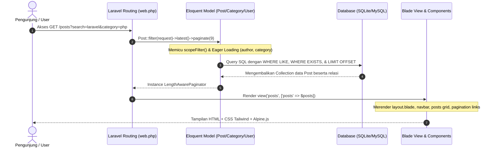

# 📝 Laravel Blog System - Modern Content Platform

Sistem blog modern berbasis **Laravel** yang dirancang dengan arsitektur bersih, performa optimal (pencegahan masalah *N+1 Query*), sistem pencarian & filtering multi-kriteria modular, serta antarmuka responsif menggunakan **Tailwind CSS**, **Flowbite**, dan **Alpine.js**.

---

## 📑 Daftar Isi

- [✨ Fitur Utama](#-fitur-utama)
- [🛠️ Tech Stack](#️-tech-stack)
- [🗄️ Arsitektur & Relasi Database](#️-arsitektur--relasi-database)
- [🔄 Alur Kerja Aplikasi (Application Lifecycle & Request Flow)](#-alur-kerja-aplikasi-application-lifecycle--request-flow)
- [🔍 Mekanisme Query Scope & Search / Filtering](#-mekanisme-query-scope--search--filtering)
- [🌐 Daftar Routing & Endpoint](#-daftar-routing--endpoint)
- [📂 Struktur Direktori](#-struktur-direktori)
- [🚀 Panduan Instalasi & Menjalankan Aplikasi](#-panduan-instalasi--menjalankan-aplikasi)
- [🧪 Database Seeder & Dummy Data](#-database-seeder--dummy-data)
- [🎨 Testing & Standar Kode](#-testing--standar-kode)

---

## ✨ Fitur Utama

1. **Sistem Blog & Artikel Terstruktur**:
   - Menampilkan artikel terbaru dalam format grid modern (3 kolom responsif).
   - Tampilan detail artikel (*single post*) lengkap dengan metadata penulis, tanggal publikasi (*human-readable* & format ISO), dan badge kategori dinamis.
   - Truncate teks artikel secara rapi menggunakan `Str::limit()`.

2. **Pencarian & Filtering Multi-Kriteria (Modular Scope)**:
   - **Pencarian Universal**: Mencari kata kunci pada `title` atau `body` artikel.
   - **Filter Kategori**: Menyaring artikel berdasarkan kategori topik tertentu.
   - **Filter Penulis**: Menyaring artikel yang ditulis oleh author spesifik.
   - **Kombinasi Filter**: Mendukung kombinasi pencarian teks bersamaan dengan filter kategori maupun penulis tanpa saling menimpa (*preserving query string* pada form & pagination).

3. **Optimasi Performa & Query Eager Loading**:
   - Menghindari masalah **N+1 Query** dengan mengimplementasikan default *Eager Loading* (`protected $with = ['author', 'category']`) pada model `Post`.
   - Menggunakan *Route Model Binding* kustom menggunakan kolom `slug` dan `username` (`{post:slug}`, `{category:slug}`, `{user:username}`) alih-alih `id`.

4. **Paginasi Pintar (Smart Pagination)**:
   - Pembagian 9 artikel per halaman dengan `paginate(9)`.
   - Integrasi `withQueryString()` agar parameter filter pencarian tetap aktif saat berpindah halaman.

5. **Antarmuka Modern & Modular (Blade Components)**:
   - Struktur layout modular berbasis Blade Component (`<x-layout>`, `<x-navbar>`, `<x-header>`, `<x-nav-link>`).
   - Navigasi responsif dengan toggle mobile menu dan dropdown profil menggunakan **Alpine.js**.
   - Komponen UI modern berbasis **Flowbite** dan **Tailwind CSS v4** dengan font typography **Inter**.
   - Badge warna kategori dinamis yang disimpan langsung dari database.

---

## 🛠️ Tech Stack

### Backend
- **Framework**: Laravel 12 / 13 (PHP 8.3+)
- **ORM**: Eloquent ORM dengan PHP 8 Attributes (`#[Fillable]`, `#[Scope]`, `#[Hidden]`)
- **Database**: SQLite (default) / MySQL / PostgreSQL support
- **Testing**: Pest PHP v5 & PHPUnit

### Frontend & Asset Bundling
- **Styling**: Tailwind CSS v4 (`@tailwindcss/vite`)
- **UI Components**: Flowbite
- **Micro-interactivity**: Alpine.js
- **Typography**: Inter Font Family
- **Build Tool**: Vite & Laravel Vite Plugin

---

## 🗄️ Arsitektur & Relasi Database

Aplikasi memiliki 3 entitas utama yang saling berelasi:

```
 ┌──────────────┐             ┌──────────────┐
 │    users     │ 1         N │    posts     │
 │──────────────│─────────────│──────────────│
 │ id (PK)      │             │ id (PK)      │
 │ name         │             │ title        │
 │ username (UQ)│             │ slug (UQ)    │
 │ email (UQ)   │             │ author_id(FK)│──────┐
 │ password     │             │ category_id  │      │
 └──────────────┘             │ body         │      │
                              │ created_at   │      │
                              │ updated_at   │      │
                              └──────────────┘      │
                                     │ N            │
                                     │              │
                                     │ 1            │
                              ┌──────────────┐      │
                              │  categories  │      │
                              │──────────────│      │
                              │ id (PK)      │      │
                              │ name         │      │
                              │ slug (UQ)    │      │
                              │ color        │      │
                              └──────────────┘      │
                                     ▲              │
                                     └──────────────┘
```

### Penjelasan Relasi:
- **`User` ➔ `Post` (`HasMany` / `BelongsTo`)**:
  - Satu `User` (Author) dapat menulis banyak `Post`.
  - Foreign key: `author_id` merujuk ke `users.id`.
- **`Category` ➔ `Post` (`HasMany` / `BelongsTo`)**:
  - Satu `Category` menaungi banyak `Post`.
  - Foreign key: `category_id` merujuk ke `categories.id`.

---

## 🔄 Alur Kerja Aplikasi (Application Lifecycle & Request Flow)

Berikut gambaran alur request saat pengguna berinteraksi dengan aplikasi blog:



---

## 🔍 Mekanisme Query Scope & Search / Filtering

Logika filter pencarian ditempatkan secara bersih pada Model `Post` menggunakan fitur **Local Query Scope**:

```php
#[Scope]
protected function scopeFilter(Builder $query, array $filters): void
{
    // 1. Filter Pencarian Teks (Judul atau Isi Body)
    $query->when(
        $filters['search'] ?? false,
        fn ($query, $search) =>
        $query->where(fn ($query) =>
            $query->where('title', 'like', '%' . $search . '%')
                  ->orWhere('body', 'like', '%' . $search . '%')
        )
    );

    // 2. Filter Kategori berdasarkan Slug Kategori
    $query->when(
        $filters['category'] ?? false,
        fn ($query, $category) =>
        $query->whereHas('category', fn ($query) =>
            $query->where('slug', $category)
        )
    );

    // 3. Filter Penulis berdasarkan Username
    $query->when(
        $filters['author'] ?? false,
        fn ($query, $author) =>
        $query->whereHas('author', fn ($query) =>
            $query->where('username', $author)
        )
    );
}
```

### Keunggulan Implementasi Ini:
1. **Pencegahan N+1 Query**: Property `$with = ['author', 'category']` memastikan data relasi user dan category diambil dalam query tunggal menggunakan `IN (...)`.
2. **Modular Query Builder**: Method `when()` hanya akan menambahkan klausa SQL jika parameter bersangkutan tersedia dalam request.
3. **Preserving Query Parameters**: Form pencarian menyertakan `<input type="hidden">` untuk parameter `category` dan `author`, sehingga ketika pengunjung mencari kata kunci saat sedang membuka kategori tertentu, filter kategori tidak hilang.

---

## 🌐 Daftar Routing & Endpoint

| Method | URI | Nama / Target View | Keterangan |
| :--- | :--- | :--- | :--- |
| `GET` | `/` | `home` | Halaman utama / Landing Page |
| `GET` | `/about` | `about` | Halaman profil About |
| `GET` | `/contact` | `contact` | Halaman kontak |
| `GET` | `/posts` | `posts` | Daftar semua artikel (Mendukung query `?search=`, `?category=`, `?author=`, `?page=`) |
| `GET` | `/posts/{post:slug}` | `post` | Halaman detail artikel tunggal berdasarkan slug |
| `GET` | `/authors/{user:username}` | `posts` | Menampilkan seluruh artikel yang ditulis oleh author tertentu |
| `GET` | `/categories/{category:slug}`| `posts` | Menampilkan seluruh artikel di bawah kategori tertentu |

---

## 📂 Struktur Direktori

```text
blogsystem/
├── app/
│   ├── Http/
│   │   └── Controllers/       # Controller aplikasi
│   └── Models/
│       ├── Category.php       # Model kategori (Relasi HasMany ke Post)
│       ├── Post.php           # Model artikel (Scope Filter & Eager Loading)
│       └── User.php           # Model pengguna/penulis (Relasi HasMany ke Post)
├── database/
│   ├── factories/             # Factory untuk generate dummy data
│   │   ├── CategoryFactory.php
│   │   ├── PostFactory.php
│   │   └── UserFactory.php
│   ├── migrations/            # Skema tabel database
│   │   ├── 0001_01_01_000000_create_users_table.php
│   │   ├── 2026_09_30_081409_create_posts_table.php
│   │   └── 2026_10_01_042510_create_categories_table.php
│   └── seeders/               # Seeder untuk inisialisasi data
│       ├── CategorySeeder.php # Menyiapkan kategori awal (Laravel, PHP, Vue, dll)
│       ├── DatabaseSeeder.php # Master seeder (Recycle factory untuk 100 posts)
│       └── UserSeeder.php     # Menyiapkan user admin & dummy users
├── resources/
│   ├── css/
│   │   └── app.css            # Styling aplikasi (Tailwind setup)
│   ├── js/
│   │   ├── app.js             # JavaScript entry point
│   │   └── bootstrap.js
│   └── views/
│       ├── about.blade.php    # Halaman about
│       ├── contact.blade.php  # Halaman kontak
│       ├── home.blade.php     # Halaman beranda
│       ├── post.blade.php     # Halaman detail artikel
│       ├── posts.blade.php    # Halaman daftar & pencarian artikel
│       └── components/        # Blade components yang dapat digunakan ulang
│           ├── header.blade.php
│           ├── layout.blade.php
│           ├── nav-link.blade.php
│           ├── nav-link-mobile.blade.php
│           └── navbar.blade.php
├── routes/
│   └── web.php                # Definisi route web aplikasi
├── tests/
│   ├── Feature/               # Feature testing (Pest / PHPUnit)
│   └── Unit/                  # Unit testing
├── composer.json              # Konfigurasi dependensi PHP
├── package.json               # Konfigurasi dependensi NPM (Tailwind & Vite)
└── vite.config.js             # Konfigurasi build Vite
```

---

## 🚀 Panduan Instalasi & Menjalankan Aplikasi

Ikuti langkah-langkah berikut untuk menjalankan proyek di komputer lokal:

### 1. Prasyarat Sistem
- **PHP** >= 8.3 (dengan ekstensi `pdo_sqlite` / `pdo_mysql`, `mbstring`, `openssl`, `tokenizer`, `xml`)
- **Composer** >= 2.x
- **Node.js** & **NPM** >= 18.x

### 2. Clone Repository & Masuk ke Direktori
```bash
git clone https://github.com/username/blogsystem.git
cd blogsystem
```

### 3. Install Dependensi PHP & Node.js
```bash
# Install package composer
composer install

# Install dependensi frontend
npm install
```

### 4. Setup Environment File
Salin file `.env.example` menjadi `.env`, lalu generate encryption key:
```bash
cp .env.example .env
php artisan key:generate
```

### 5. Setup Database & Jalankan Migrasi + Seeder
Secara default aplikasi menggunakan SQLite. Buat file database jika belum ada, lalu jalankan migrasi beserta data awal:
```bash
# Buat file database SQLite (jika menggunakan SQLite)
touch database/database.sqlite

# Jalankan migrasi dan seeding data
php artisan migrate:fresh --seed
```

> [!TIP]
> Perintah `--seed` akan secara otomatis membuat 1 user utama (`abirusabil`), 10 user dummy, 5 kategori teknologi (`Laravel`, `PHP`, `JavaScript`, `Vue`, `React`), serta **100 artikel blog dummy** yang tersebar di antara author dan kategori tersebut.

### 6. Menjalankan Server Pengembangan (Dev Server)

Jalankan server Laravel dan Vite secara bersamaan:

```bash
# Jalankan menggunakan Composer script bawaan
composer run dev

# ATAU jalankan di dua terminal terpisah:
# Terminal 1:
php artisan serve

# Terminal 2:
npm run dev
```

Buka browser dan akses aplikasi melalui tautan:
👉 **[http://127.0.0.1:8000](http://127.0.0.1:8000)** atau **[http://localhost:8000](http://localhost:8000)**

---

## 🧪 Database Seeder & Dummy Data

Sistem seeding menggunakan teknik **Factory Recycling** (`recycle()`) untuk memastikan data realistis tanpa menciptakan duplikasi entitas yang berlebihan:

- **Akun Default Penulis**:
  - **Nama**: Abiru Sabil
  - **Username**: `abirusabil`
  - **Email**: `R9P7o@example.com`
  - **Password**: `password`
- **Kategori Bawaan**:
  - `Laravel` (`#FF2D20`)
  - `PHP` (`#777777`)
  - `JavaScript` (`#F0DB4F`)
  - `Vue` (`#42b883`)
  - `React` (`#61dafb`)

---

## 🎨 Testing & Standar Kode

Proyek ini telah dikonfigurasi dengan standar kode modern dan tool testing:

### Menjalankan Automated Tests
```bash
php artisan test
# Atau menggunakan Pest runner langsung
vendor/bin/pest
```

### Memeriksa & Memperbaiki Format Kode (Pint)
```bash
vendor/bin/pint --format agent
```

---

<p align="center">Dikembangkan dengan ❤️ menggunakan <b>Laravel Framework</b></p>
